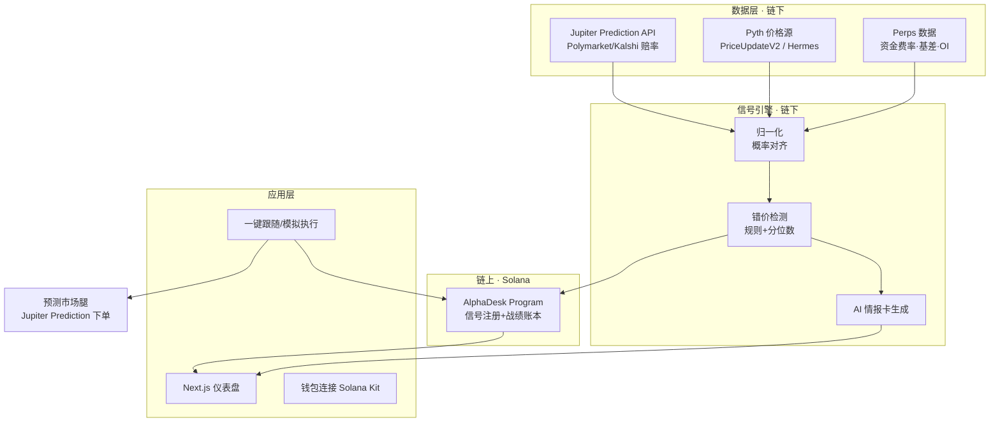

# Prediction Alpha Agent — 产品与技术方案（PRD v0.1）

> 主攻方向 ①。本文档回答三件事：**做什么**、**怎么搭**、**一周内怎么把它变成一份能提交的 demo**。所有外部接口均已核实，可直接照做。

---

## 一、产品定义

**一句话**：一个 7×24 运行的 AI 情报台，把**预测市场的隐含概率**与**永续合约的定价信息**放在一起比对，自动发现系统性错价，输出一张可读、可分享的情报卡，并支持一键执行。

**它解决什么**：同一件事——比如「BTC 会不会在 X 日前站上某价」——在预测市场里有一个价格，在永续合约的资金费率与基差里也隐含着一个判断。这两个市场各看各的，**没人替你盯着它们之间的分歧**。人工盯盘又慢又累。这个 agent 就是替你做这件事。

**给评委的一句话 pitch**：

> Prediction 与 Perps 是同一个问题的两种定价方式，市场却把它们割裂。我们用一个永不休息的 AI agent 把两边接起来，把「分歧」变成可执行的信号——而且 agent 的历史战绩上链，可验证、不可篡改。

这句话同时命中了赛道的三个评审维度：**原创性**（跨市场而非又做一个交易台）、**技术扎实**（真实数据源 + 链上账本）、**赛后还活着**（工具能被持续使用，且有内容分发）。

---

## 二、目标用户与核心场景

| 用户 | 痛点 | 你给的价值 |
| --- | --- | --- |
| 加密散户 / 内容受众 | 看不懂预测市场赔率意味着什么，也懒得对比合约数据 | 一条情报卡讲清「哪边更可能错」 |
| 半专业交易者 | 想跨市场套利，但工具割裂、盯不过来 | 自动扫描 + 一键执行 |
| 内容创作者（你自己） | 需要持续的、有信息量的选题 | 每张情报卡就是一条内容 |

> **核心场景走一遍**：agent 发现「预测市场给某宏观事件定价 72%，但 BTC 永续的资金费率和隐含波动仍在日均水平」→ 生成情报卡（事件、分歧幅度、历史同类案例、建议动作、风险）→ 用户点「跟随」→ 记录战绩 → 同一张卡一键分享到社媒。检测、执行、传播三个动作闭环在一个界面里。

---

## 三、功能范围：MVP 与加分项

先划死边界，否则一周做不完。

**MVP（必须交付，缺一不可）**

- 接入真实预测市场数据，能列出/搜索事件与市场定价

- 接入真实永续数据（价格 + 资金费率）

- 跑通**至少 1 类**错价信号，能自动产出

- 一张可视化情报卡（含 AI 生成的解读）

- 「跟随/模拟执行」按钮，记录到链上账本

- 一个能看懂的 dashboard（信号列表 + 详情）

**加分项（时间允许再做）**

- 多类信号 + 信号历史回测

- 真实下单执行（预测市场腿用 USDC，永续腿走 SDK）

- 战绩排行榜（链上可验证）

- 情报卡一键生成分享图 / 推到 X

---

## 四、系统架构与数据流



**关键取舍**：让**链上只做「信任」这件事**——信号注册与战绩账本；交易执行和计算都放在链下，用现成 API。这样既真实可演示，又不至于一周内被链上复杂度拖垮。

---

## 五、数据与技术选型（已核实）

### 预测市场腿

Jupiter Prediction API 直接可用，把 Polymarket 与 Kalshi 的流动性聚合好了，连撮合、持仓、结算都替你处理。[citation](https://developers.jup.ag/docs/guides/how-to-build-a-prediction-market-app-on-solana)

- **Base URL**：`https://api.jup.ag/prediction/v1`；请求头需 `x-api-key`（在 `developers.jup.ag/portal` 申请）

- **定价语义**：每个市场是 YES/NO 二元，价格区间 0.01–0.99，**价格即隐含概率**；结算时赢的合约每份付 $1

- **金额格式**：所有 USD 值用原生单位，`1,000,000 = $1.00`

- **常用端点**：

| 端点 | 用途 |
| --- | --- |
| `GET /events` | 列出事件（可按 `category` / `filter=new·live·trending` / `provider=polymarket·kalshi` 过滤） |
| `GET /events/search?query=` | 关键词搜索事件 |
| `GET /markets/{marketId}` | 取市场实时定价与状态 |
| `POST /orders` | 创建订单，返回**未签名交易** |
| `GET /positions?ownerPubkey=` | 查用户持仓 |
| `POST /positions/{positionPubkey}/claim` | 领取奖金，返回未签名交易 |

订单生命周期：创建 → 用户签名提交 → Jupiter keeper 撮合 → 持仓更新 → 市场结算 → 领奖。

### 永续数据腿

- **Jupiter Perps**：LP 池模型（JLP），可交易标的仅约 5 个（BTC/ETH/SOL + 稳定币抵押），最高 250x 杠杆。[citation](https://developers.jup.ag/docs/perps)

- 注意：Jupiter 的 **Perps API 官方仍标注为「work in progress」**——所以永续腿的数据建议走下方 Pyth/Pyth 派生，或直接解析 Perps 程序的 IDL。[citation](https://developers.jup.ag/docs/perps)

- **Drift**：链上订单簿 + JIT 拍卖 + 兜底 AMM，长尾标的更多，taker 费从 10 bps 起。[citation](https://eco.com/support/en/articles/15083167-drift-protocol-solana-perpetuals-dex-deep-dive)

- **备选**：Jupiter 的 Price API 可一次取最多 50 个 token 的 USD 价，适合批量拉行情。[citation](https://developers.jup.ag/docs/perps)

### 价格 / 预言机

Pyth 在 Solana 上是 **pull 预言机**：价格更新以 `PriceUpdateV2` 账户形式传入，Anchor 里加一个 `Account<'info, PriceUpdateV2>` 字段即可读，用 `get_price_no_older_than(&clock, maxAge)` 校验时效。[citation](https://docs.pyth.network/price-feeds/core/use-real-time-data/pull-integration/solana)

> 两个已核实的坑，提前记下：**① Pyth Core 已于 2026/8/26 升级，Hermes 现在需要 API Key**，新集成请用新版合约地址；**② **<strong>`pyth-solana-receiver-sdk`</strong>** 与 **<strong>`anchor-lang`</strong>** 版本不匹配会编译报错**（`PriceUpdateV2: AccountDeserialize` 未满足）。让 AI 先在「Version Compatibility Matrix」技能里对好版本再动手。

### 基础设施

- **OrbitFlare**：超低延迟 RPC + 原始 shred 级实时数据流，Rust/TS/Go SDK，本届赞助方——用它既提升体验，又可能命中赞助奖。

- **Solana 官方 Agent Skills**：`npx skills add https://github.com/solana-foundation/solana-dev-skill`，含前端 Kit、Codama IDL 生成、测试策略、安全清单。

- **协议级 Agent Skills**:Pyth、Ranger Finance（跨 Drift/Flash/Jupiter 的永续聚合）、PNP Protocol（无许可预测市场）等可直接喂给 AI.

---

## 六、信号引擎：怎么定义「错价」

起步**不要上机器学习**，用可解释的规则 + 分位数，评委看得懂、你也好调。

**信号类型 A｜跨市场定价分歧**（主力）

用 Pyth 实时价与历史波动率，算出某价格阈值事件的「模型概率」，与预测市场的隐含概率对比。偏离越大信号越强，用历史分布做 z-score 标准化：

$$z = \frac{p_{\text{market}} - p_{\text{model}}}{\sigma_{\text{hist}}}$$

当 $$|z|$$ 超过阈值（例如 2）且持续若干周期 → 产出信号，方向为「预测市场定价偏高/偏低」。

**信号类型 B｜拥挤度预警**

资金费率处于历史高分位，说明多头拥挤；若此时预测市场情绪也一边倒 → 反向风险预警。

**信号类型 C｜事件驱动的未反应窗口**

当某新闻在预测市场已引起概率跳变、而永续的波动率/资金费率尚未反应 → 短窗口信号。这一类最贴近你已有的那篇《末日期权与预测市场套利》的观察。

---

## 七、AI 情报卡：输出结构与提示词框架

情报卡是整个产品的「面子」，也是你内容的分发单元。

**输出结构（JSON）**

```json
{
  "event": "事件标题与结算条件",
  "market_ref": {"provider": "polymarket", "market_id": "..."},
  "signal_type": "cross_market_divergence",
  "direction": "prediction_overpriced",
  "confidence": 0.72,
  "evidence": ["模型概率 0.58", "市场隐含 0.72", "z=2.4", "资金费率 92 分位"],
  "historical_analog": "2024 CPI 前夜同类分歧的后续表现",
  "suggested_action": "在预测市场卖出 YES / 建立对冲",
  "risk_notes": "结算条件歧义、流动性薄、预言机时效"
}
```

**提示词框架（喂给你自己的 AI）**：

- **角色**：资深加密衍生品交易员 + 风险官。

- **输入**：上一步的结构化信号数据（JSON）。

- **任务**：生成一段不超过 200 字的中文解读 + 显著的风险提示，**不得编造未提供的数据**。

- **约束**：明确标注这是研究/情报，不构成投资建议；所有数字必须来自输入。

- **输出**：严格返回上面的 JSON schema。

---

## 八、链上部分：AlphaDesk Program 做什么

刻意做小、做实，让「上万行代码」的诱惑远离你。

| 指令 | 作用 |
| --- | --- |
| `register_signal` | 把信号的哈希与关键参数写入，形成一个可追溯的信号记录 |
| `follow_signal` | 用户跟随某信号时记录（账户 + 时间戳 + 引用信号） |
| `record_outcome` | 事件结算后写入结果，累积每个信号的战绩 |

这样产出的**可验证 AI 战绩排行榜**，是这个项目最容易被记住的差异点：别人只是「又一个 agent」，你的 agent 有链上、不可篡改的履约记录。

---

## 九、仓库结构（脚手架）

```plaintext
prediction-alpha-agent/
├─ apps/
│  └─ web/                     # Next.js + Solana Kit 仪表盘
├─ services/
│  ├─ ingest/                  # 拉取预测市场 + perp 数据，写入 DB
│  ├─ signals/                 # 错价检测引擎（规则 + 分位数）
│  └─ narrator/                # 调 LLM 生成情报卡
├─ programs/
│  └─ alpha_desk/              # Anchor 程序：信号注册 + 战绩账本
├─ packages/
│  └─ shared/                  # 共享类型 + Codama 生成的客户端
├─ docs/
├─ .env.example
└─ README.md
```

先跑通官方 Bootcamp 的「Prediction Market」全栈示例（源码在 `solana-foundation/solana-bootcamp-2026`），把它的链上与前端骨架当起点，再往上叠你的信号层。[citation](https://solana.com/developers/bootcamp/fullstack-apps/prediction-market)

---

## 十、README 模板

```markdown
# Prediction Alpha Agent

一句话：把预测市场赔率与永续定价的错价，变成可执行、可验证的 AI 信号。

## 演示
- 视频：<链接>
- 在线 demo：<链接>
- 截图：<...>

## 它做什么
<3 句话>

## 架构
<贴上面的数据流图>

## 快速开始
1. 环境：Node 20+ / Rust + Solana CLI / Anchor
2. `cp .env.example .env` 并填入 `JUP_API_KEY`、`PYTH_API_KEY`、`RPC_URL`
3. `pnpm install && pnpm dev`

## 数据来源
Jupiter Prediction API · Pyth Price Feeds · Jupiter Perps / Drift

## 信号逻辑
<简述 3 类信号>

## 链上
AlphaDesk Program（devnet）：<程序地址>

## 路线图 / 赛后计划
<说明这个项目为什么不会停在 hackathon>
```

最后两节是评委的「赛后还活着」检查点，别省。

---

## 十一、里程碑与任务拆解

| 阶段 | 关键任务 | 谁 | 完成标准 |
| --- | --- | --- | --- |
| P0 本周 | 报名、建 Colosseum 档案、发招募、申请 Jupiter/Pyth API Key | 你 | 账号就绪 + 至少 1 名技术队友 |
| P1 环境 | 装 Agent Skills、跑通 Bootcamp 示例、devnet 跑通一笔预测市场交易 | 队友 + AI | devnet 上完成一笔买卖 |
| P2 数据 | ingest 层接通预测市场 + Pyth 价，落库 | 队友 + AI | 拉到真实事件与实时价 |
| P3 信号 | 落地信号类型 A，能自动产出信号 | 你定规则 + AI 实现 | 有一次真实信号产出 |
| P4 上链 | AlphaDesk 程序 + 前端「跟随」打通 | 队友 + AI | devnet 上记录成功 |
| P5 冲刺 | 前端打磨、录 3 分钟视频、写 README、提交 | 你 + 队友 | 提交物齐备 |

---

## 十二、3 分钟 Demo 脚本

| 时间 | 内容 | 要点 |
| --- | --- | --- |
| 0:00–0:25 | 问题 | 预测市场与永续在给同一件事定价，却彼此割裂 |
| 0:25–0:50 | 产品 | agent 永不休息，专盯两边分歧 |
| 0:50–2:20 | 实机演示 | 真实赔率 → 产出情报卡 → 一键跟随 → 链上留下战绩 |
| 2:20–3:00 | 为什么重要 | 用内容分发能力证明「赛后还活着」+ 下一步路线图 |

---

## 十三、风险与降级方案

| 风险 | 触发信号 | 降级方案 |
| --- | --- | --- |
| Jupiter Perps API 仍为 WIP | 拿不到稳定资金费率 | 永续腿改用 Pyth 派生的波动率/基差，或解析 Perps 程序 IDL；资金费率换公开数据源 |
| API Key / 限流 | 请求被拒或超限 | 加缓存层、用 lite-api、把抓取频率降到底 |
| 链上复杂度失控 | 一周内程序跑不通 | 链上只留「战绩账本」，执行全走 API |
| Pyth SDK 版本冲突 | 编译报 anchor-lang 错误 | 按官方 Version Compatibility Matrix 对齐版本 |
| 评委非技术向 | 演示被当成「又一个交易台」 | 开头先讲「两个市场的分歧」这个故事，再进技术 |

> **保命线**：无论进度如何，保证「预测市场数据 + 一张 AI 情报卡 + 前端展示」这条最小链路一定能跑。有它，你就有一份完整可提交的作品；其余都是加分。

---

## 十四、AI 协作工作流（怎么把「不会链上」压到最低）

1. **先装技能**：`npx skills add https://github.com/solana-foundation/solana-dev-skill`，再把 Pyth、Ranger、PNP 等协议级技能按需喂给 AI。

2. **先跑通再改**：拿官方 Bootcamp 示例当基线，让 AI 在可运行的项目上做增量修改，别让它从空目录起步。

3. **版本先对齐**：动手前让 AI 查 Version Compatibility Matrix，把 Anchor / Solana CLI / Rust / Node 版本钉死。

4. **用 IDL 生成客户端**：让 AI 走 Codama 从 IDL 生成类型安全客户端，别手写序列化。

5. **测试用 LiteSVM / Mollusk / Surfpool**：链上逻辑本地快速验证，别一开始就上 devnet 反复试。

6. **上线前过一遍 Security Checklist**：账户校验、签名校验这些最常见漏洞。

7. **每完成一个可演示的切片就录屏**：素材攒到最后剪辑，视频不再是负担。

---

## 十五、下一步（我可以立刻帮你做的）

- **A. 生成仓库脚手架**：按第九节的目录，把 `README.md`、`.env.example`、目录骨架和 ingest 层的接口占位写出来。

- **B. 起草招募帖 + build-in-public 首篇**：把选题讲成一个别人愿意加入、也愿意看的故事。

- **C. 把 3 分钟脚本扩写成逐镜台词**：精确到每句旁白和每个画面。

- **D. 整理你的资料库素材**：把 Perps / 预测市场那批文章重编成项目叙事与 FAQ，用于 README 和路演。

说「先做 A」或直接点你要的那项，我就接着产出。